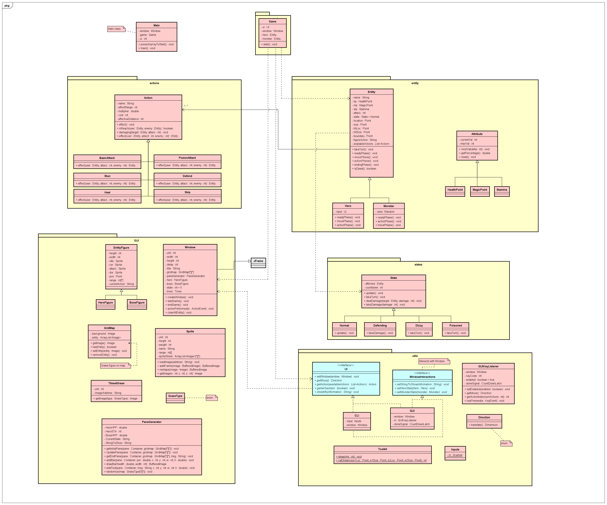

# Final-Project

## 遊戲介紹

我們設計了一款以棋盤進行的回合制戰棋遊戲，在 `20*30` 格的地圖中，玩家操控英雄以打敗敵人為目標。遊戲流程為由英雄先攻，依序進入以下四個階段：
- 準備階段：耐力回復為最大值，處理狀態效果並對狀態做更新。
- 移動階段：消耗耐力值進行移動，移動到目的地後可選擇跳過移動階段。
- 行動階段：可選擇技能進行施放，電腦會判定玩家技能是否使用成功。
- 結束階段：回合結束，判定遊戲勝負是否分曉。

而隨後輪到敵人的回合，由電腦決定四階段的行為，雙方重複以上流程直到一方血量歸零，遊戲結束。

<!--- ## 安裝及啟動

遊玩此遊戲需要 java 環境。下載這個目錄下的所有檔案後，若是 Unix-like 的作業系統，可直接輸入這個指令自動編譯、啟動遊戲：
```
make run
```
若是 Windows 系統，可依序輸入下列指令編譯、啟動遊戲：
```
mkdir out
javac -d out src/*.java src/control/*.java src/entities/*.java src/actions/*.java src/states/*.java src/utils/*.java src/GUI/*.java
java -cp out Main
```
-->

## 遊戲玩法

移動階段時，玩家可使用 w、s、a、d 來進行上、下、左、右方向的移動，以 h 或空白鍵來跳過移動階段。
行動階段則按照 GUI 指示以 0 ~ 9 來施放對應技能。

每個技能必定發動，並根據雙方距離決定是否命中。如果命中，則該技能之 傷害/恢復/特殊狀態 必定生效。

### 技能列表
- 共通技能：
  - 放空 (Skip)：不施放技能，直接結束回合。
  - 基本攻擊 (Basick Attack)：距離 1 以內的敵方受到 1 倍攻擊傷害。
- 英雄特有技能：
  - 毒害 (Poison)：距離 1 以內的敵方受到 0.25 倍攻擊傷害並中毒 (Poisoned)
    - 中毒狀態將使敵方每回合受到 5 點傷害，持續 3 回合。
  - 暈眩 (Stun)：距離 1 以內的敵方受到 0.25 倍攻擊傷害並暈眩 (Dizzy)
    - 暈眩狀態將使敵方跳過共 3 回合的 移動/行動 階段。
  - 治療 (Heal)：自身恢復 10 點生命。
  - 防禦 (Defend)：自身進入防禦 (Defending) 狀態。
    - 防禦狀態可使自己在 1 回合內受到的傷害減少 0.25 倍。

## Class Diagram (For reference)
